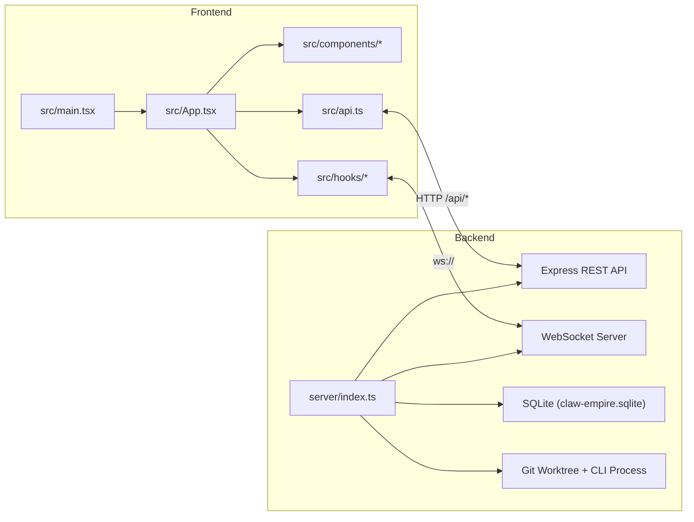
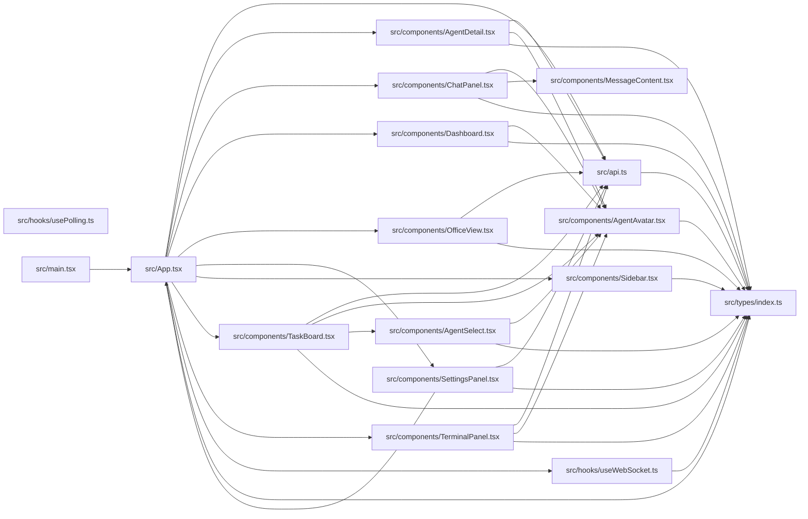
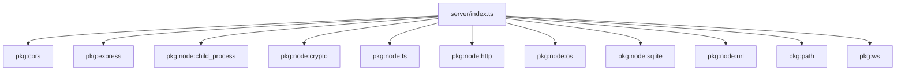
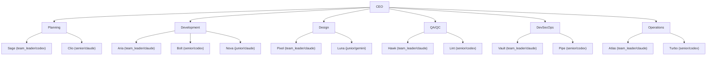

# Architecture Map

Generated at: 2026-02-18T03:50:20.460Z

## How to Regenerate

```bash
npm run arch:map
```

## System Overview



## Project Tree

```text
climpire
├── docs/
│   ├── architecture/
│   │   ├── architecture.json
│   │   ├── backend-dependencies.mmd
│   │   ├── CEO-STRUCTURE-MAP.md
│   │   ├── frontend-imports.mmd
│   │   ├── org-chart.mmd
│   │   ├── README.md
│   │   └── source-tree.txt
│   └── DESIGN.md
├── public/
│   ├── public/sprites/ (61 sprite files)
│   └── climpire.svg
├── scripts/
│   └── generate-architecture-report.mjs
├── server/
│   └── index.ts
├── src/
│   ├── assets/
│   ├── components/
│   │   ├── AgentAvatar.tsx
│   │   ├── AgentDetail.tsx
│   │   ├── AgentSelect.tsx
│   │   ├── ChatPanel.tsx
│   │   ├── Dashboard.tsx
│   │   ├── MessageContent.tsx
│   │   ├── OfficeView.tsx
│   │   ├── SettingsPanel.tsx
│   │   ├── Sidebar.tsx
│   │   ├── TaskBoard.tsx
│   │   └── TerminalPanel.tsx
│   ├── game/
│   ├── hooks/
│   │   ├── usePolling.ts
│   │   └── useWebSocket.ts
│   ├── pages/
│   ├── types/
│   │   └── index.ts
│   ├── api.ts
│   ├── App.tsx
│   ├── index.css
│   └── main.tsx
├── .env
├── .env.example
├── .gitignore
├── index.html
├── package.json
├── pnpm-lock.yaml
├── tsconfig.app.json
├── tsconfig.app.tsbuildinfo
├── tsconfig.json
├── tsconfig.node.json
├── tsconfig.node.tsbuildinfo
└── vite.config.ts
```

## Frontend Import Graph



## Backend Dependency Graph



## API Routes (Server)

| Method | Route |
| --- | --- |
| GET | `/{*splat}` |
| GET | `/api/agents` |
| GET | `/api/agents/:id` |
| PATCH | `/api/agents/:id` |
| POST | `/api/agents/:id/spawn` |
| POST | `/api/announcements` |
| GET | `/api/cli-status` |
| GET | `/api/cli-usage` |
| POST | `/api/cli-usage/refresh` |
| GET | `/api/departments` |
| GET | `/api/departments/:id` |
| GET | `/api/health` |
| DELETE | `/api/messages` |
| GET | `/api/messages` |
| POST | `/api/messages` |
| GET | `/api/oauth/callback/antigravity` |
| GET | `/api/oauth/callback/github-copilot` |
| POST | `/api/oauth/disconnect` |
| POST | `/api/oauth/github-copilot/device-poll` |
| POST | `/api/oauth/github-copilot/device-start` |
| GET | `/api/oauth/models` |
| GET | `/api/oauth/start` |
| GET | `/api/oauth/status` |
| GET | `/api/settings` |
| PUT | `/api/settings` |
| GET | `/api/stats` |
| GET | `/api/subtasks` |
| PATCH | `/api/subtasks/:id` |
| GET | `/api/tasks` |
| POST | `/api/tasks` |
| DELETE | `/api/tasks/:id` |
| GET | `/api/tasks/:id` |
| PATCH | `/api/tasks/:id` |
| POST | `/api/tasks/:id/assign` |
| GET | `/api/tasks/:id/diff` |
| POST | `/api/tasks/:id/discard` |
| POST | `/api/tasks/:id/merge` |
| POST | `/api/tasks/:id/resume` |
| POST | `/api/tasks/:id/run` |
| POST | `/api/tasks/:id/stop` |
| POST | `/api/tasks/:id/subtasks` |
| GET | `/api/tasks/:id/terminal` |
| GET | `/api/worktrees` |
| GET | `/api/api-providers` |
| POST | `/api/api-providers` |
| GET | `/api/api-providers/presets` |
| PUT | `/api/api-providers/:id` |
| DELETE | `/api/api-providers/:id` |
| POST | `/api/api-providers/:id/test` |
| GET | `/api/api-providers/:id/models` |
| GET | `/api/cli-models` |
| POST | `/api/oauth/refresh` |
| POST | `/api/oauth/accounts/activate` |
| PUT | `/api/oauth/accounts/:id` |
| GET | `/api/skills` |
| GET | `/api/skills/detail` |
| POST | `/api/skills/learn` |
| GET | `/api/skills/learn/:jobId` |
| GET | `/health` |
| GET | `/healthz` |

## API Calls (Frontend)

| Endpoint Pattern |
| --- |
| `/api/agents` |
| `/api/agents/:param` |
| `/api/announcements` |
| `/api/api-providers` |
| `/api/api-providers/:param` |
| `/api/api-providers/:param/test` |
| `/api/api-providers/:param/models` |
| `/api/api-providers/presets` |
| `/api/cli-models` |
| `/api/cli-status` |
| `/api/cli-usage` |
| `/api/cli-usage/refresh` |
| `/api/departments` |
| `/api/departments/:param` |
| `/api/messages` |
| `/api/oauth/disconnect` |
| `/api/oauth/github-copilot/device-poll` |
| `/api/oauth/github-copilot/device-start` |
| `/api/oauth/models` |
| `/api/oauth/refresh` |
| `/api/oauth/accounts/activate` |
| `/api/oauth/accounts/:param` |
| `/api/oauth/start` |
| `/api/oauth/status` |
| `/api/settings` |
| `/api/skills` |
| `/api/skills/detail` |
| `/api/skills/learn` |
| `/api/skills/learn/:param` |
| `/api/stats` |
| `/api/subtasks` |
| `/api/subtasks/:param` |
| `/api/tasks` |
| `/api/tasks/:param` |
| `/api/tasks/:param/assign` |
| `/api/tasks/:param/diff` |
| `/api/tasks/:param/discard` |
| `/api/tasks/:param/merge` |
| `/api/tasks/:param/resume` |
| `/api/tasks/:param/run` |
| `/api/tasks/:param/stop` |
| `/api/tasks/:param/subtasks` |
| `/api/tasks/:param/terminal` |
| `/api/worktrees` |

## WebSocket Event Matrix

| Event | Server Broadcast | Frontend Listen |
| --- | --- | --- |
| agent_status | yes | yes |
| announcement | yes | yes |
| chat_stream | yes | yes |
| cli_output | yes | yes |
| cli_usage_update | yes |  |
| cross_dept_delivery | yes | yes |
| messages_cleared | yes |  |
| new_message | yes | yes |
| pointerdown |  | yes |
| subtask_update | yes | yes |
| task_update | yes | yes |

## DB Tables

| Table |
| --- |
| `agents` |
| `api_providers` |
| `cli_usage_cache` |
| `departments` |
| `messages` |
| `oauth_credentials` |
| `oauth_states` |
| `settings` |
| `subtasks` |
| `task_logs` |
| `tasks` |

## Sub-Agent Organization (from SQLite)



| Department | Agent | Role | CLI Provider |
| --- | --- | --- | --- |
| Planning | Sage | team_leader | codex |
| Planning | Clio | senior | claude |
| Development | Aria | team_leader | claude |
| Development | Bolt | senior | codex |
| Development | Nova | junior | claude |
| Design | Pixel | team_leader | claude |
| Design | Luna | junior | gemini |
| QA/QC | Hawk | team_leader | claude |
| QA/QC | Lint | senior | codex |
| DevSecOps | Vault | team_leader | claude |
| DevSecOps | Pipe | senior | codex |
| Operations | Atlas | team_leader | claude |
| Operations | Turbo | senior | codex |

> **CLI Provider types**: `claude`, `codex`, `gemini`, `copilot` (GitHub Copilot OAuth), `antigravity` (Google Antigravity OAuth), `api` (external API provider)
